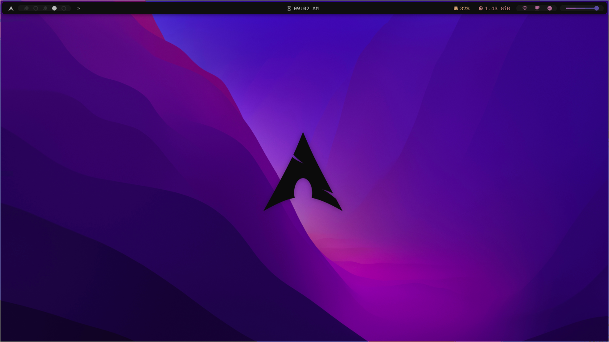

## Thermal Rice v0.1

- os: [Arch](https://archlinux.org/)
- wm: [Bspwm](https://github.com/baskerville/bspwm)
- bar: [Polybar](https://github.com/polybar/polybar)
- compositor: [Picom](https://github.com/yshui/picom)
- launcher: [Rofi](https://github.com/davatorium/rofi)
